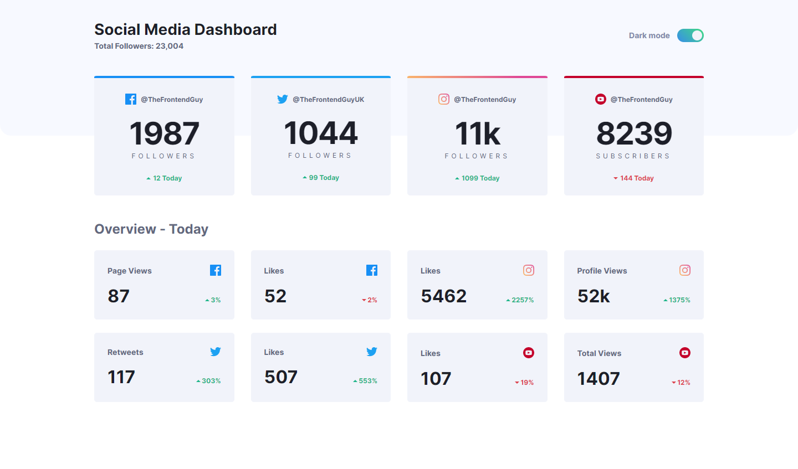
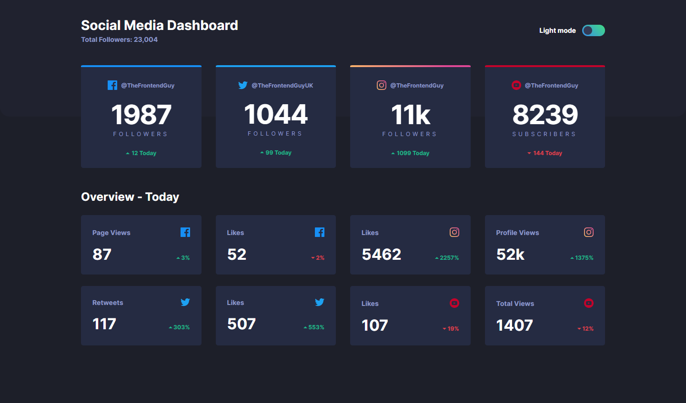
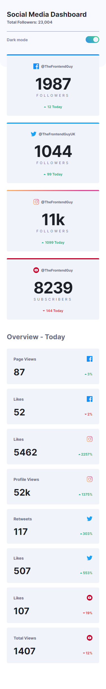
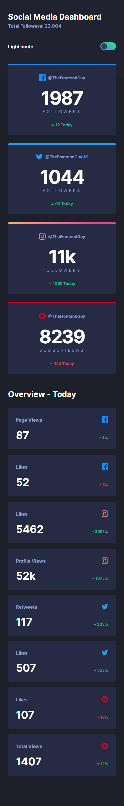

# Frontend Mentor - Social media dashboard with theme switcher solution

This is a solution to the [Social media dashboard with theme switcher challenge on Frontend Mentor](https://www.frontendmentor.io/challenges/social-media-dashboard-with-theme-switcher-6oY8ozp_H). Frontend Mentor challenges help you improve your coding skills by building realistic projects.

## Table of contents

- [Overview](#overview)
  - [The challenge](#the-challenge)
  - [Screenshot](#screenshot)
  - [Links](#links)
- [My process](#my-process)
  - [Built with](#built-with)
  - [What I learned](#what-i-learned)
- [Author](#author)

## Overview

### The challenge

Users should be able to:

- View the optimal layout for the page depending on their device's screen size
- See hover states for all interactive elements on the page
- Toggle color theme to their preference

### Screenshot

### Links

- Solution URL: (https://www.frontendmentor.io/solutions/responsive-social-media-dashboard-with-theme-switcher-QpnvJPnrK)
- Live Site URL: (https://lm-social-media-dashboard.netlify.app/)

## My process

### Built with

- Semantic HTML5 markup
- CSS Grid & autofit/minmax
- CSS custom properties/vars
- Desktop-first workflow
- Javascript

### What I learned

I would say I learned how to effectively put together a full theme switching system. Organising CSS colour variables, changing the theme via and button, saving theme to local storage & using the users OS theme preference.

A more comprehensive overview of this process and struggles I faced, see this project I did a couple days before this:

[Github user search app](https://github.com/NinjaInShade/github-user-search)

## Author

- Website - [Leon Michalak](https://www.leonmichalak.dev)
- Frontend Mentor - [@NinjaInShade](https://www.frontendmentor.io/profile/NinjaInShade)
- Instagram - [@TheFrontendGuy](https://www.instagram.com/thefrontendguy/)
